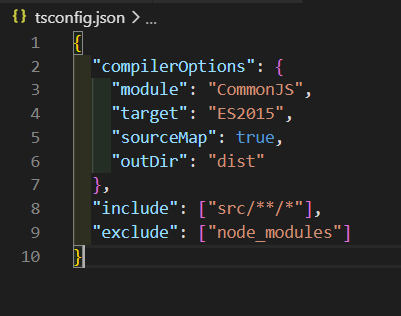

# typechain

Learning Typescript by making a Blockchain with it

- typescript는 프로그래밍 언어, 자바스크립트 처럼 생겼다.  
  컴파일하면 자바스크립트로 컴파일 된다.

- typescript는 자바스크립트가 갖고 있지 않은 규칙들을 갖고 있다.  
  자바스크립트는 엄격한 규칙이 없고, 사용하기 쉽고, 원하는 방향으로 수정하기도 편하다는 장점이 있다.  
  그러나 큰 프로젝트를 한다거나, 팀으로 일을 할 때 버그를 최소화 하고 싶을 때 위의 장점이 단점이 된다.  
  그래서 typescript는 superset of JavaScript  
  언어가 예측가능하고, 읽기 쉬운 코드 등등 자바스크립트를 더 잘 사용할 수 있게 해준다.

- typescript 설치  
  npm i -g typescript  
  버전 확인  
  tsc -v

- tsconfig.json 파일 만들기  
  TypeScript에게 어떻게 JS로 변환하는지 알려주면서 옵션을 만든다.

- ts -> js로 컴파일하기 **tsc**
  터미널 tsc  
  tsc는 ts파일 코드를 컴파일해서 js와 js.map을 만든다.

- npm start 할 때마다 prestart 먼저 실행하고 start 실행하는 법  
  package.json 파일에서  
  "scripts"에 "start": "node index.js" 추가  
  npm start를 입력하면 node에서 index.js가 실행된다.
  그 전에 ts파일 컴파일해야한다.  
  "scripts"에 "prestart": "tsc" 추가

  - node.js는 TS를 이해하지 못하기 때문에 JS로 컴파일하는 작업이 필요하다

- TypeScript는 Typed 언어라는 건데, 이 뜻은  
  어떤 종류의 변수와 데이터인지 설정을 해줘야 한다.  
  **TS는 정확하게 어떤 값이 나올지 알려준다.**

- 계속 npm start 하기가 귀찮아졌다.  
  watch모드로 실행해 저장할 때마다 컴파일되도록 만든다.  
  watch모드 설치  
  **npm add tsc-watch --dev**  
  src폴더, dist폴더를 만든 후  
  package.json수정한다. "start", "prestart"를 지우고  
  **"start": "tsc-watch --onSuccess \" node dist/index.js\" "**

- tsconfig.json 수정  
  ts파일은 src로 들어가고  
  컴파일 된 파일들은 dist로 들어간다.  
  {:height="300" width="250"}
